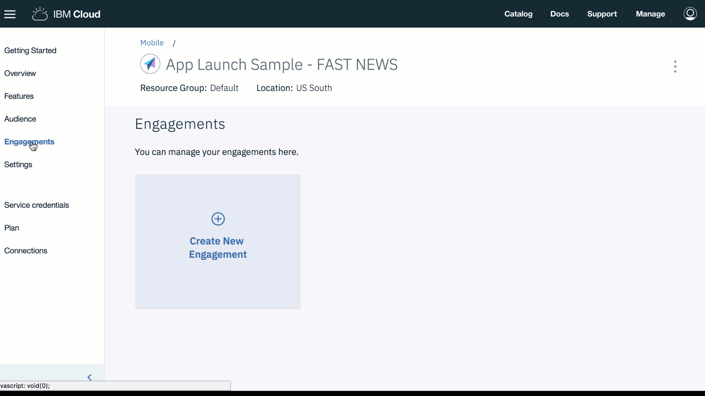

---

copyright:
 years: 2017, 2018, 2019

---

{:new_window: target="_blank"}
{:shortdesc: .shortdesc}
{:screen:.screen}
{:codeblock:.codeblock}

# Setup Feature Control
{: #feature_control}
Last updated: 17 February 2019
{: .last-updated}

You can create an engagement using Feature Control. 

Through this engagement an app owner can control the visibility of a feature by enabling or disabling it during runtime.

A feature can be enabled/disabled to all the application users or to a specific set of users and devices. 

Feature roll outs can be scheduled and co-ordinated by defining a start/end time and date. You can also choose a specific day on which a defined feature should be enabled/disabled.

**Enabling Feature Control Capability**

Ensure that you have gone through and have the necessary [prerequisites](/docs/services/app-launch/app_prerequisites.html) in place.

Complete the following steps to create an engagement using the Feature Control:

1. You can create an engagement using either of the following methods:
	- Click **Engagements** in the navigation pane. 
	- Select **Create Engagements** on the new Feature that you have created.
	- In the navigation pane, click **Overview** > **Create New Engagement** .
	
2. The New Engagement window appears.
	
3. Provide a name and description to your new engagement. Ensure that you give a unique engagement name, and not one that is already listed in Engagements.

     **Select Engagement type** as **Feature Control**	
	
	To do a controlled experiment with multiple variants of the feature, select **A/B testing** on the **Select Experimentation Type**. Click **Next**.
	
4. Choose the Feature that you have created. You can also choose to add and define the variants that you might want to experiment with. Click **Next**.

5. Select an audience. Click **Next**.

6. Define a trigger by choosing Time and the **Start** date/time and an **End** date/time. Click **Save**.

7. The new engagement now appears in the Engagement Details window.

You can now measure the [performance](/docs/services/app-launch/app_measure_performance.html) of your engagement.

