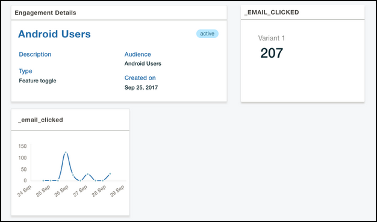

---

copyright:
 years: 2017, 2018, 2019

---

{:new_window: target="_blank"}
{:shortdesc: .shortdesc}
{:screen:.screen}
{:codeblock:.codeblock}

# Analyzing the response results
{: #applaunch_type}
Last updated: 17 February 2019
{: .last-updated}

<!-- App Launch empowers you to create and collect Feature Metrics for the various engagements that you have created. -->
App Launch empowers you to create and collect Metrics for the various engagements that you have created.

<!-- Ensure that you have gone through and have completed the [prerequisites](/docs/services/app-launch/app_prerequisites.html) and have [created an engagement using Feature Control](/docs/services/app-launch/app_feature_toggle.html).  -->
Ensure that you have completed the [prerequisites](/docs/services/app-launch/app_prerequisites.html) and have created an engagement. 

Complete the following steps to collect metrics for the engagements that you have created:

1. Click **Engagements**.

2. Choose the engagement that you have created. 

	The Engagement Details window displays the collected information. 

	

The graph gives you real-time insights on how the feature was received by the target audience. You can use the information to understand the highlights or pain points and hence make further customization to the feature before rolling out the feature to broader audience.
	

