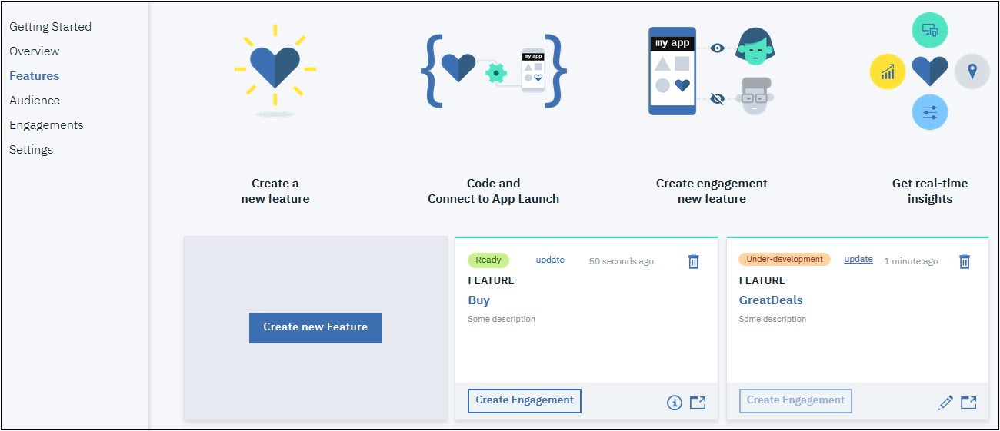
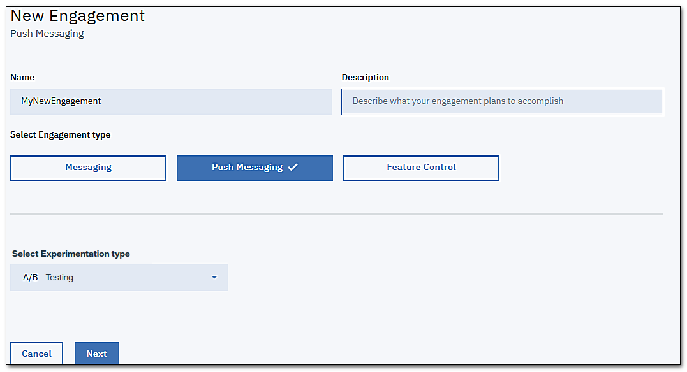
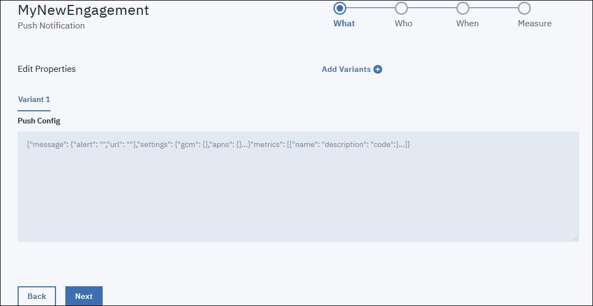
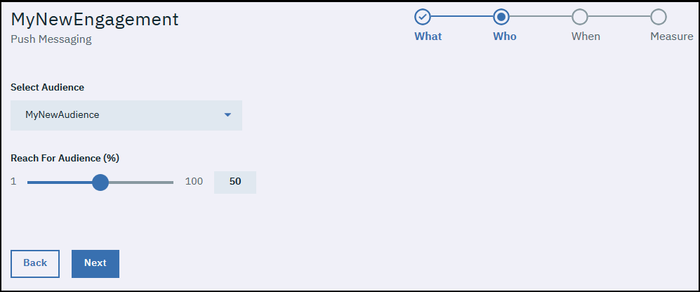
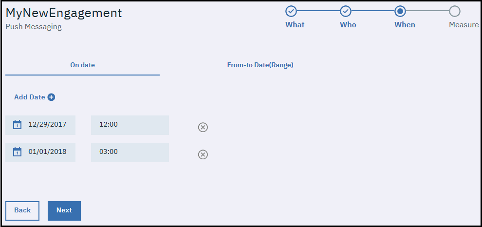
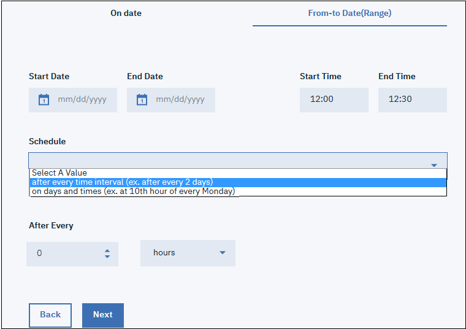

---

copyright:
 years: 2017

---

{:new_window: target="_blank"}
{:shortdesc: .shortdesc}
{:screen:.screen}
{:codeblock:.codeblock}

# Setup Push messaging
{: #app_push}
Last updated: 18 January 2018
{: .last-updated}

You can create an engagement using Push Messaging.

Through this engagement an app owner can send notifications to the app users even when the app is not in use.

You can deliver these notifications as an onscreen banner alert or to a device's locked screen, thus providing information updates that are quick and easily accessible. 

Notifications can be targeted to all application users or to a specific set of users and devices. For every message that you submit to the service, the intended audience receives a notification.

Sending notifications can be scheduled and co-ordinated by defining a start/end time and date. You can also choose a specific day on which a message should be sent.

If you have already chosen to use Push Notifications service either as a part of MobileFirst Services Starter Boilerplate or as IBM Cloud Dedicated Services you can use the same with your app.

**Enabling Push Messaging Capability**

Ensure that you have gone through and have the necessary [prerequisites](app_prerequisites.html) in place.

Complete the following steps to create an engagement using the **Push Messaging** option:

1. You can create an engagement using either of the following methods:
	- Click **Engagements** in the navigation pane. 
	- Select **Create Engagement** on the new Feature that you have created.
	- In the navigation pane, click **Overview** > **Create New Engagement**.

	

2. The New Engagement window appears.
 
	3. Provide a name and description to your new engagement. Ensure that you give a unique engagement name and not one that is already listed in Engagements.

    **Select Engagement type** as **Push Messaging**
	
	To do a controlled experiment with multiple variants of the messaging feature, select **A/B testing** on the **Select Experimentation Type**.

	
	
4. Click **Next**. 

5. Fill in the Push configuration details. The details are passed as Json objects.

      

6. Click **Next**.   
   
7. **Select Audience** and the percentage of audience you want to reach out to.

	
	
8. Click **Next**.

9. Define sending Push notifications with the below options

    - **On Date** 
	
	
	
    **Add date** and a start time to send a push message. A message can be sent on multiple dates.
	
    - **From-to-Date(Range)**
	
	
	
    **Start/End Date and Time**. 
	**Schedule** sending the messages with the listed scheduling options.
	
10. Click **Next**.	

11. Map the elements to the metrics you want to measure through them. Select the element and fill in the metric details.

	
	
12. Click **Save**.	

The new engagement now appears in the Engagement Details window. You can now measure the performance of your engagement.	

## Configure Push Settings

To configure the Push settings, complete the following steps:

1. Click **Settings** in the navigation pane.

2. Enter the configuration keys to initialize your Push Notifications. Refer the [Push API Reference](https://console-regional.stage1.ng.bluemix.net/apidocs/800-push-notifications?&language=shell_curl#introduction) link for more details.

   The payload information can be got from the **POST sendMessage** section.

3. Enter the **Push Notification App Secret**, **Push Notification App GUID**, and **Push Notification Client Secret** to configure your Push notifications.

    
	
4. Click **Save**.	

	

	
	

