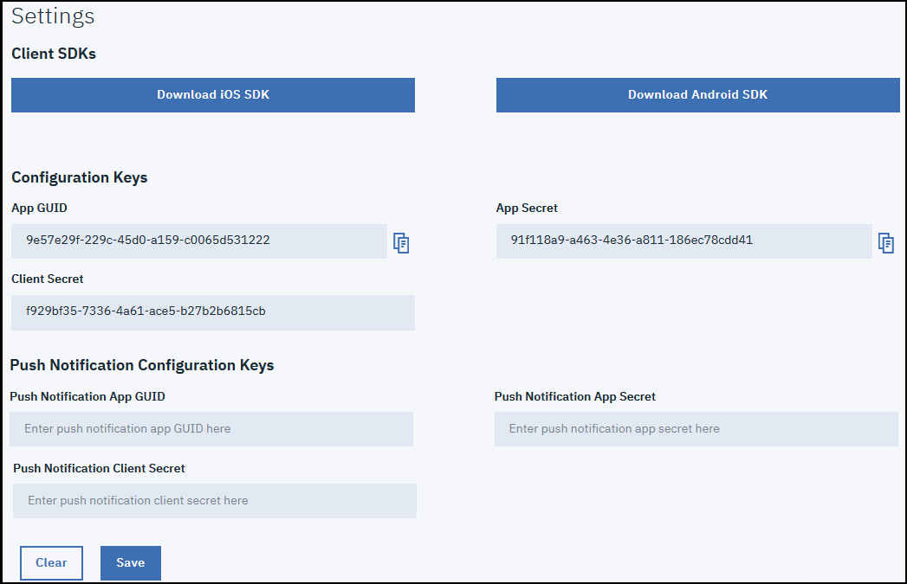

---

copyright:
 years: 2017

---

{:new_window: target="_blank"}
{:shortdesc: .shortdesc}
{:screen:.screen}
{:codeblock:.codeblock}

# Configuring Push Settings
{: #app_push_settings}
Last updated: 18 January 2018
{: .last-updated}

Click **Settings** in the navigation pane

1. Click **Settings**.
1. Download either of the SDK's, based on your platform type:
	- [iOS](https://github.ibm.com/Engage/bms-clientsdk-ios-swift-engage)
	- [Android](https://github.ibm.com/Engage/bms-clientsdk-android-engage)

2. Copy the configuration keys to initialize your App. Use the App Secret, App GUID, and Client Secret to configure your app and create engagements.

