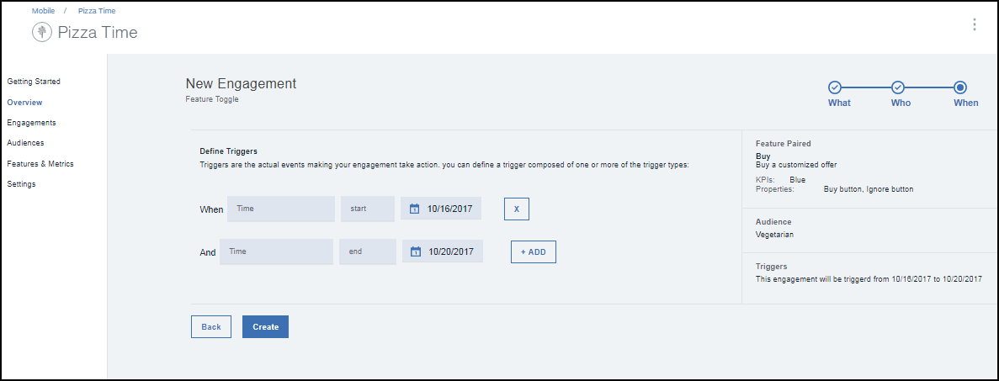

---

copyright:
 years: 2017

---

{:new_window: target="_blank"}
{:shortdesc: .shortdesc}
{:screen:.screen}
{:codeblock:.codeblock}

# Projekt mithilfe von Feature Control erstellen
{: #feature_control}
Letzte Aktualisierung: 12. Oktober 2017
{: .last-updated}

Mithilfe von Feature Control können Sie ein Projekt erstellen. 

Stellen Sie sicher, dass die erforderlichen [Voraussetzungen](app_prerequisites.html) erfüllt sind.

Die folgende Abbildung enthält eine Übersicht über die Schritte, die zur Erstellung eines Features ausgeführt werden müssen.
	

Führen Sie die folgenden Schritte aus, um mithilfe von Feature Control ein Projekt zu erstellen:

1. Für die Erstellung eines Projekts kann eine der folgenden Methoden verwendet werden:
	- Klicken Sie auf **Projekte** im Navigationsbereich. 
	- Wählen Sie **Projekt erstellen** für das neue Feature aus, das Sie erstellt haben.
	- Klicken Sie im Navigationsbereich auf **Übersicht** > **Neues Projekt erstellen**.
	
2. Das Fenster für neue Projekte wird angezeigt.
 
	
3. Geben Sie einen Namen und eine Beschreibung für das neue Projekt an. Stellen Sie sicher, dass der Projektname eindeutig und nicht bereits unter den Projektnamen aufgeführt ist.
	
	Für ein kontrolliertes Experiment mit mehreren Varianten des Features wählen Sie **A/B-Test** als Experimentmodus aus.

4. Klicken Sie auf **Weiter**.
5. Wählen Sie das erstellte Feature aus. Sie können auch die Varianten hinzufügen und definieren, für die das Experiment ausgeführt werden soll.
 

5. Klicken Sie auf **Weiter**.
6. Wählen Sie eine Zielgruppe aus.
	

5. Klicken Sie auf **Weiter**.
6. Definieren Sie einen Auslöser, indem Sie die Uhrzeit sowie das Start- und Enddatum auswählen.
 
7. Klicken Sie auf **Erstellen**.
8. Das neue Projekt wird nun im Fenster mit den Projektdetails angezeigt.
	

Sie könne nun die [Leistung](app_measure_performance.html) des Projekts messen.

