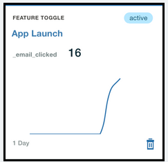

---

copyright:
 years: 2017

---

{:new_window: target="_blank"}
{:shortdesc: .shortdesc}
{:screen:.screen}
{:codeblock:.codeblock}

# Ergebnisse der Reaktion analysieren
{: #applaunch_type}
Letzte Aktualisierung: 18. Januar 2018
{: .last-updated}

<!-- App Launch empowers you to create and collect Feature Metrics for the various engagements that you have created. -->
Mithilfe von App Launch können Sie Metriken für die verschiedenen Projekte, die Sie erstellt haben, erstellen und erfassen.

<!-- Ensure that you have gone through and have completed the [prerequisites](app_prerequisites.html) and have [created an engagement using Feature Control](app_feature_toggle.html).  -->
Stellen Sie sicher, dass alle [Voraussetzungen](app_prerequisites.html) erfüllt sind und dass ein Projekt erstellt wurde. 

Führen Sie die folgenden Schritte aus, um Metriken für die erstellten Projekte zu erfassen:

1. Klicken Sie auf **Projekte**.

2. Wählen Sie das erstellte Projekt aus. 

	Im Fenster mit Projektdetails werden die erfassten Informationen angezeigt. 

	

Das Diagramm liefert Einblicke zur Reaktion der Zielgruppe auf das Feature in Echtzeit. Sie können die Informationen verwenden, um Schwerpunkte und Problempunkte zu analysieren, und so weitere Anpassungen für das betreffende Feature vornehmen, bevor Sie es einer größeren Zielgruppe bereitstellen.
	

 

