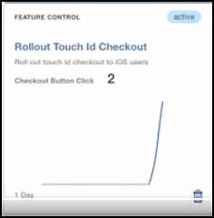

---

copyright:
 years: 2017

---

{:new_window: target="_blank"}
{:shortdesc: .shortdesc}
{:screen:.screen}
{:codeblock:.codeblock}

# Reaktion auf Features analysieren
{: #applaunch_type}
Letzte Aktualisierung: 12. Oktober 2017
{: .last-updated}

Mithilfe von App Launch können Sie Featuremetriken für die verschiedenen Projekte, die Sie erstellt haben, erstellen und erfassen.

Stellen Sie sicher, dass alle [Voraussetzungen](app_prerequisites.html) erfüllt sind und dass ein [Projekt mithilfe von Feature Control erstellt](app_feature_toggle.html) wurde. 

Führen Sie die folgenden Schritte aus, um Metriken für die erstellten Projekte zu erfassen:

1. Klicken Sie auf **Projekte**.

2. Wählen Sie das erstellte Projekt aus. 

	Im Fenster mit Projektdetails werden die erfassten Informationen angezeigt. 

	

Das Diagramm liefert Einblicke zur Reaktion der Zielgruppe auf das Feature in Echtzeit. Sie können die Informationen verwenden, um Schwerpunkte und Problempunkte zu analysieren, und so weitere Anpassungen für das betreffende Feature vornehmen, bevor Sie es einer größeren Zielgruppe bereitstellen.
	

 

