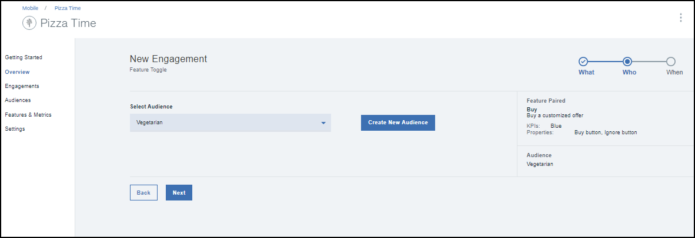
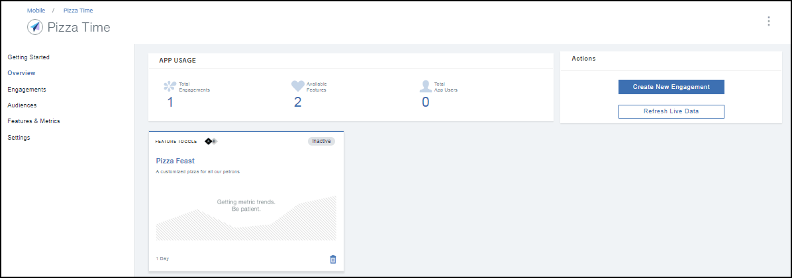

---

copyright:
 years: 2017

---

{:new_window: target="_blank"}
{:shortdesc: .shortdesc}
{:screen:.screen}
{:codeblock:.codeblock}

# Creación de una fidelización mediante Control de características
{: #feature_control}
Última actualización: 12 de octubre de 2017
{: .last-updated}

Puede crear una fidelización mediante Control de características. 

Compruebe que ha realizado todos los [requisitos previos](app_prerequisites.html) necesarios y que dispone de ellos.

La imagen siguiente le ofrece una visión general de los pasos necesarios para crear una característica.
	
Efectúe los pasos siguientes para crear una fidelización mediante Control de características:

1. Puede crear una fidelización mediante uno de los métodos siguientes:
	- Pulse **Fidelizaciones** en el panel de navegación. 
	- Seleccione **Crear fidelizaciones** en la nueva Característica que ha creado.
	- En el panel de navegación, pulse **Visión general** > **Crear nueva fidelización**.
	
2. Aparecerá la ventana Nueva fidelización.
 
	
3. Indique un nombre y una descripción para la nueva fidelización. Indique un nombre de fidelización exclusivo, que no aparezca ya en la lista de Fidelizaciones.
	
	Para realizar un experimento controlado con varias variantes de la característica, seleccione **Pruebas A/B** en el Modo de experimentación.

4. Pulse **Siguiente**.
5. Seleccione la nueva Característica que ha creado. También puede seleccionar añadir y definir las variantes con las que es posible que desee experimentar.
	

5. Pulse **Siguiente**.
6. Seleccione un público.
	

5. Pulse **Siguiente**.
6. Defina un desencadenante seleccionando la Hora y la fecha de inicio y una fecha de finalización.

7. Pulse **Crear**.
8. La nueva fidelización aparecerá en la ventana Detalles de fidelización.
	

Ahora puede medir el [rendimiento](app_measure_performance.html) de su fidelización.

