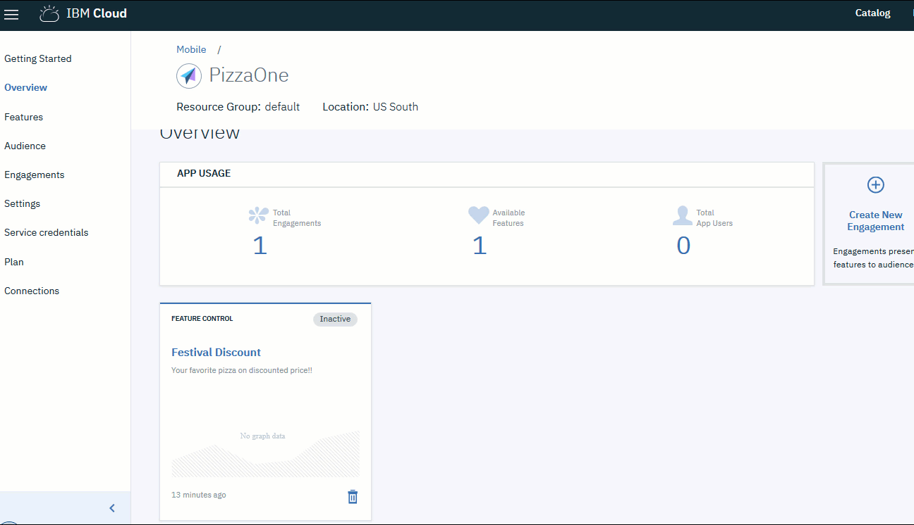

---

copyright:
 years: 2017

---

{:new_window: target="_blank"}
{:shortdesc: .shortdesc}
{:screen:.screen}
{:codeblock:.codeblock}

# Configuración de la mensajería in-app
{: #app_messaging}
Última actualización: 18 de enero de 2018
{: .last-updated}

Puede crear una fidelización utilizando la mensajería in-app. 

A través de esta fidelización el propietario de una app puede enviar notificaciones a los usuarios de la app mientras están utilizando la aplicación.

Los mensajes pueden dirigirse a todos los usuarios de las aplicaciones o a un conjunto específico de usuarios y dispositivos. Por cada mensaje que se envía al servicio, los usuarios de destino recibirán una notificación.

Los mensajes in-app pueden planificarse definiendo una fecha y hora de inicio y fin. También puede realizar una planificación en función de un suceso.

Estos mensajes estarán más personalizados, ya que se basan en información analítica acerca de la elección del usuario, las interacciones de usuario, los dispositivos, los registros de aplicación, etc.

Se pueden utilizar los mensajes in-app para:

- Enviar mensajes personalizados
- Enviar mensajes a los usuarios que han desactivado las notificaciones push
- Solicitar un comentario o interactuar con los usuarios en una conversación
- Enviar mensajes relevantes después de saber qué está buscando el usuario
- Interactuar con clientes fieles y activos
- Informar a los usuarios de las actualizaciones de la app o del lanzamiento de una nueva característica, etc.

**Habilitar la capacidad de mensajería in-app**

Compruebe que ha realizado todos los [requisitos previos](app_prerequisites.html) necesarios y que dispone de ellos.

Efectúe los pasos siguientes para crear una fidelización utilizando la opción Mensajería:

1. Puede crear una fidelización mediante uno de los métodos siguientes:
	- Pulse **Fidelizaciones** en el panel de navegación. 
	- Seleccione **Crear fidelizaciones** en la nueva característica que ha creado.
	- En el panel de navegación, pulse **Visión general** > **Crear nueva fidelización**.
	
2. Aparecerá la ventana Nueva fidelización.
	
3. Indique un nombre y una descripción para la nueva fidelización. Indique un nombre de fidelización exclusivo, que no aparezca ya en la lista de Fidelizaciones.

    **Seleccione Tipo de fidelización ** como **Mensajería in-app**
	
	Para realizar un experimento controlado con múltiples variantes de la característica de mensajería, seleccione **Pruebas A/B** en **Seleccionar tipo de experimentación**. Pulse **Siguiente**.

4. Rellene las propiedades de mensaje y pulse **Siguiente**.
	
5. **Seleccionar público** y el porcentaje de público que quiere alcanzar. Pulse **Siguiente**.

6. Defina un desencadenante seleccionando **Fecha y hora de inicio y fin**. 

    **Seleccione Suceso.**  Pulse **Siguiente**.	

7. Correlacione los elementos con la métrica que desea medir a través de ellos. Seleccione el elemento y rellene los detalles de la métrica. Pulse **Guardar**.	

La nueva fidelización aparecerá en la ventana Detalles de fidelización.
	
Ahora puede medir el [rendimiento](app_measure_performance.html) de su fidelización.	
	

