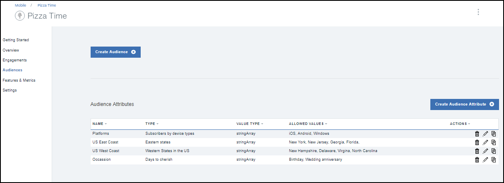

---

copyright:
 years: 2017

---

{:new_window: target="_blank"}
{:shortdesc: .shortdesc}
{:screen:.screen}
{:codeblock:.codeblock}

# Requisitos previos
{: #prerequisites}
Última actualización: 13 de octubre de 2017
{: .last-updated}

## Creación de una instancia de servicio de App Launch
{: #prerequisites_1}

1. En [IBM Cloud Catalog](https://console.ng.bluemix.net/catalog/), pulse **Móvil** > **App Launch**.
2. Indique un nombre de servicio y un nombre de credencial.
3. Elija conectar con otras apps existentes o dejarlo sin enlazar.
4. Pulse **Crear**.

Puede elegir crear un servicio enlazado o no enlazado. Los servicios enlazados se conectan a otras apps de IBM Cloud, mientras que los servicios no enlazados son independientes y no están conectados a otras apps. De forma predeterminada, las apps del servicio App Launch no están enlazadas.

## Inicialización de la app
{: #prerequisites_app}

1. Pulse **Valores**.
1. Descargue una de los SDK, según su tipo de plataforma:
	- [iOS](https://github.ibm.com/Engage/bms-clientsdk-ios-swift-engage)
	- [Android](https://github.ibm.com/Engage/bms-clientsdk-android-engage)

2. Copie las claves de configuración para inicializar la App. Utilice el Secreto de App, el GUID de App y el Secreto de cliente para configurar su app y crear fidelizaciones.

## Creación de una característica
{: #prerequisites_2}

El servicio de {{site.data.keyword.engage_short}} le permite crear y probar reacciones a características. 

Para crear una característica, realice los pasos siguientes:

1. Pulse **Características y métricas** > **Crear característica**.

2. Actualice el formulario Crear nueva característica y métricas con un nombre de característica y una descripción apropiados. También puede definir las propiedades de la característica y añadir métricas para medir la repercusión de su fidelización.

3. Pulse **Crear**. Aparecerá la nueva característica en el panel Características y métricas.

4. Para habilitar una característica para utilizarla como fidelización, pulse la Característica que ha creado.

5. En la ventana Detalles de característica, seleccione Actualizar el estado de la característica a **Listo**.

6. Pulse **Actualizar estado**.

7. Actualice la app para que se incluyan los códigos de característica y los atributos recién creados en la app de iOS o Android. 

8. La característica está lista para utilizar.

## Creación de un público
{: #prerequisites_2}

Para crear un público, realice los pasos siguientes:

1. Cree un atributo de público. 

	a. Pulse **Público** > **Crear atributo de público**.

	b. Indique los siguientes valores:

	- **Nombre**: indique un nombre apropiado para el atributo.
	- **Descripción**: una breve descripción del atributo.
	- **Tipo**: seleccione el tipo de atributo.
	- **Valores permitidos**: indique los valores de atributo que desea utilizar.

	

	En función de lo que necesite, puede crear diversos atributos de público, como muestra la lista de la imagen siguiente.
	
	

2. Cree un público.

	a. Pulse **Crear público**.

	b. Indique un nombre y una descripción apropiados en la ventana Nuevo público.

	c. Seleccione un atributo y pulse **Añadir**.

	

	d. Seleccione las opciones necesarias de la lista de atributos.

	e. Pulse **Guardar**.

Ahora puede crear una fidelización mediante la opción [Control de características](app_feature_toggle.html).
