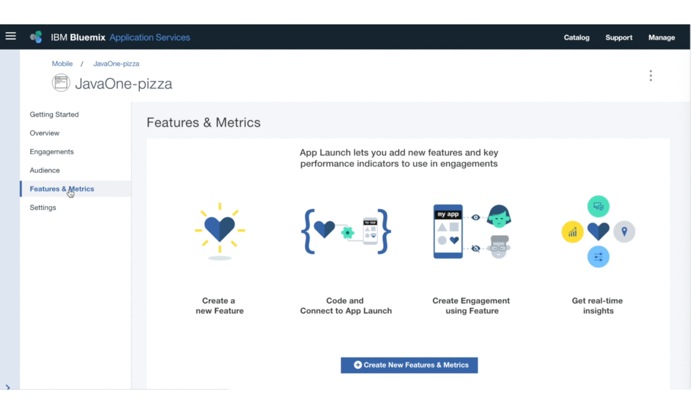

---

copyright:
 years: 2017

---

{:new_window: target="_blank"}
{:shortdesc: .shortdesc}
{:screen:.screen}
{:codeblock:.codeblock}

# Création d'un engagement à l'aide de l'option Feature Control
{: #feature_control}
Dernière mise à jour : 12 octobre 2017
{: .last-updated}

Vous pouvez créer un engagement à l'aide de l'option Feature Control. 

Vérifiez que tous les [prérequis](app_prerequisites.html) nécessaires sont satisfaits.

L'image suivante présente les étapes à effectuer pour créer une fonction.
	

Pour créer un engagement à l'aide de l'option Feature Control, procédez comme suit :

1. Vous pouvez créer un engagement en utilisant l'une des méthodes suivantes :
	- Cliquez sur **Engagements** dans le panneau de navigation. 
	- Sélectionnez **Create Engagements** sur la fonction que vous avez créée.
	- Dans le panneau de navigation, cliquez sur **Overview** > **Create New Engagement** .
	
2. La fenêtre New Engagement s'ouvre.
 
	
3. Entrez un nom et une description pour le nouvel engagement. Assurez-vous de fournir un nom d'engagement unique, pas un nom déjà répertorié dans la liste Engagements.
	
	Pour effectuer une expérimentation contrôlée avec plusieurs variantes de la fonction, sélectionnez **A/B testing** comme mode d'expérimentation.

4. Cliquez sur **Next**.
5. Sélectionnez la fonction que vous avez créée. Vous pouvez également choisir d'ajouter et de définir des variantes que vous voulez expérimenter.
	

5. Cliquez sur **Next**.
6. Sélectionnez un public.
	

5. Cliquez sur **Next**.
6. Définissez un déclencheur en sélectionnant Horodatage et la date de début et la date de fin.
	
7. Cliquez sur **Create**.
8. Le nouvel engagement s'affiche désormais dans la fenêtre Engagement Details.

Vous pouvez maintenant mesurer les [performances](app_measure_performance.html) de votre engagement.

