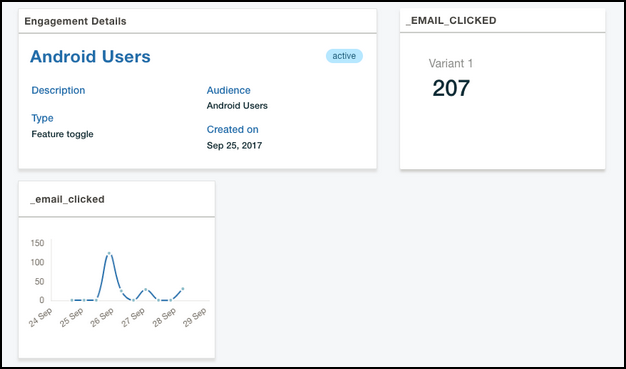

---

copyright:
 years: 2017

---

{:new_window: target="_blank"}
{:shortdesc: .shortdesc}
{:screen:.screen}
{:codeblock:.codeblock}

# Analyse des résultats d'une réponse
{: #applaunch_type}
Dernière mise à jour le 18 janvier 2018
{: .last-updated}

<!-- App Launch empowers you to create and collect Feature Metrics for the various engagements that you have created. -->
Le service App Launch vous permet de créer et de collecter des métriques pour les divers engagements que vous avez créés.

<!-- Ensure that you have gone through and have completed the [prerequisites](app_prerequisites.html) and have [created an engagement using Feature Control](app_feature_toggle.html).  -->
Vérifiez que tous les [prérequis](app_prerequisites.html) sont satisfaits et que vous avez créé un engagement. 

Pour collecter des métriques sur les engagements que vous avez créés, procédez comme suit :

1. Cliquez sur **Engagements**.

2. Sélectionnez l'engagement que vous avez créé. 

	La fenêtre Engagement Details affiche les informations collectées. 

	

Le graphique présente une analyse en temps réel de la manière dont la fonction a été reçue par le public cible. Vous pouvez utiliser ces informations pour évaluer les points forts et les points faibles et pour personnaliser plus encore la fonction avant de la proposer à un public plus large.
	

 

