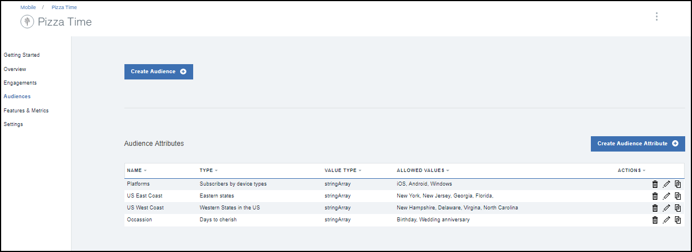

---

copyright:
 years: 2017

---

{:new_window: target="_blank"}
{:shortdesc: .shortdesc}
{:screen:.screen}
{:codeblock:.codeblock}

# Prérequis
{: #prerequisites}
Dernière mise à jour : 13 octobre 2017
{: .last-updated}

## Création d'une instance de service App Launch
{: #prerequisites_1}

1. Dans le [catalogue IBM Cloud](https://console.ng.bluemix.net/catalog/), cliquez sur **Mobile** > **App Launch**.
2. Indiquez un nom pour le service et un nom pour les données d'identification.
3. Choisissez de vous connecter à d'autres applications existantes ou laissez le service non lié.
4. Cliquez sur **Créer**.

Vous pouvez choisir de créer un service lié ou un service non lié. Les services liés sont connectés à d'autres applications IBM Cloud, tandis que les services non liés restent autonomes sans connexion à d'autres applications. Les applications de service App Launch sont, par défaut, non liés.

## Initialisation de votre application
{: #prerequisites_app}

1. Cliquez sur **Paramètres**.
1. Téléchargez l'un des SDK, selon votre type de plateforme :
	- [iOS](https://github.ibm.com/Engage/bms-clientsdk-ios-swift-engage)
	- [Android](https://github.ibm.com/Engage/bms-clientsdk-android-engage)

2. Copiez les clés de configuration pour initialiser votre application. Utilisez la valeur confidentielle de l'application, l'identificateur global unique de l'application et la valeur confidentielle du client pour configurer votre application et créer des engagements.

## Création d'une fonction
{: #prerequisites_2}

Le service {{site.data.keyword.engage_short}} permet de créer et de tester des réponses à des fonctions. 

Pour créer une fonction, procédez comme suit :

1. Cliquez sur **Features & Metrics** > **Create Feature**.

2. Mettez à jour le formulaire Create New Feature and Metrics avec le nom et la description de fonction appropriés. Vous pouvez également définir les propriétés de la fonction et ajouter des métriques afin de mesurer l'impact de votre engagement.

3. Cliquez sur **Create**. La nouvelle fonction s'affiche désormais dans le panneau Features and Metrics.

4. Pour activer une fonction à utiliser en tant qu'engagement, cliquez sur la fonction que vous avez créée.

5. Dans la fenêtre Feature Details, sélectionnez la mise à jour du statut de votre fonction en **Ready**.

6. Cliquez sur **Update Status**.

7. Mettez votre application à jour en incluant les nouveaux attributs et codes de fonction créés dans votre application iOS ou Android. 

8. La nouvelle fonction est maintenant prête pour utilisation.

## Création d'un public
{: #prerequisites_2}

Pour créer un public, procédez comme suit :

1. Créez un attribut de public. 

	a. Cliquez sur **Audience** > **Create Audience Attribute**.

	b. Indiquez les valeurs suivantes :

	- **Name** : Entrez un nom approprié pour l'attribut.
	- **Description** : Entrez une brève description de l'attribut.
	- **Type** :	Sélectionnez un type d'attribut.
	- **Allowed values** : Entrez les valeurs d'attribut que vous voulez utiliser.

	

	Selon vos besoins, vous pouvez créer plusieurs attributs de public, tels que répertoriés dans l'image suivante.
	
	

2. Créez un public.

	a. Cliquez sur **Create Audience**.

	b. Entrez un nom et une description appropriés dans la fenêtre New Audience.

	c. Sélectionnez un attribut, puis cliquez sur **Add**.

	

	d. Sélectionnez les options requises dans les attributs répertoriés.

	e. Cliquez sur **Save**.

Vous pouvez maintenant créer un engagement à l'aide de l'option [Feature Control](app_feature_toggle.html).
