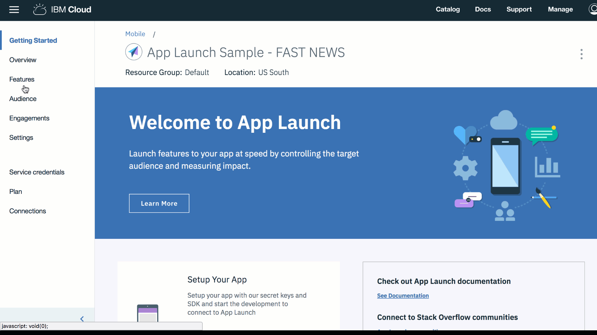

---

copyright:
 years: 2017

---

{:new_window: target="_blank"}
{:shortdesc: .shortdesc}
{:screen:.screen}
{:codeblock:.codeblock}

# Prérequis
{: #prerequisites}
Dernière mise à jour le 18 janvier 2018
{: .last-updated}

## Création d'une instance du service App Launch
{: #prerequisites_1}

1. Dans le [catalogue IBM Cloud](https://console.ng.bluemix.net/catalog/), cliquez sur **Mobile** > **App Launch**.
2. Fournissez un nom de service.
3. Cliquez sur **Create**.
4. Choisissez de vous connecter à d'autres applications existantes ou laissez le service non lié.

Vous pouvez choisir de créer un service lié ou un service non lié. Les services liés sont connectés à d'autres applications IBM Cloud, tandis que les services non liés restent autonomes, sans connexion à d'autres applications. Les applications du service App Launch sont, par défaut, non liés.

## Initialisation de votre application
{: #prerequisites_app}

1. Cliquez sur **Paramètres**.
1. Téléchargez un SDK correspondant à votre type de plateforme :
	- [iOS](https://github.com/ibm-bluemix-mobile-services/bms-clientsdk-swift-applaunch)
	- [Android](https://github.com/ibm-bluemix-mobile-services/bms-clientsdk-android-applaunch)

2. Copiez les clés de configuration pour initialiser votre application. Utilisez la valeur confidentielle de l'application, l'identificateur global unique de l'application et la valeur confidentielle du client pour configurer votre application et créer des engagements.

## Création d'une fonction
{: #prerequisites_2}

Le service {{site.data.keyword.engage_short}} permet de créer et de tester des réponses à des fonctions. 

Pour créer une fonction, procédez comme suit :

1. Dans le panneau de navigation, cliquez sur **Features** > **Create New Feature** 

2. Mettez à jour le formulaire Create New Feature and Metrics avec le nom et la description de la fonction. Vous pouvez également définir les propriétés de la fonction et ajouter des métriques afin de mesurer l'impact de votre engagement. Cliquez sur **Bulk edit** pour ajouter plusieurs propriétés en éditant le fichier JSON.

3. Cliquez sur **Create**. La nouvelle fonction apparaît maintenant sur le panneau des fonctions. 

4. Développez la fonction, puis activez-la.

5. Pour activer une fonction à utiliser en tant qu'engagement, cliquez sur la fonction que vous avez créée.

6. Dans la fenêtre Feature Details, remplacez le statut de votre fonction par **Ready**.

7. Cliquez sur **Update Status**.

8. Mettez votre application à jour en incluant les attributs et codes de fonction que vous venez de créer dans votre application iOS ou Android. 

9. La fonction est maintenant prête à être utilisée.

La fenêtre Feature Details possède une option qui permet d'exporter la fonction sous forme de fichier JSON, que vous pouvez utiliser dans l'application client pour charger les valeurs par défaut.

## Création d'un public
{: #prerequisites_2}

Pour créer un public, procédez comme suit :

1. Créez un attribut de public. 

	Cliquez sur **Audience** > **Create Attribute**.

	Indiquez les valeurs suivantes :

	- **Name** : Entrez un nom approprié pour l'attribut.
	- **Description** : Entrez une brève description de l'attribut.
	- **Type** :	Sélectionnez un type d'attribut.
	- **Allowed values** : Entrez les valeurs d'attribut que vous voulez utiliser.

    Selon vos besoins, vous pouvez créer plusieurs attributs de public, tels que répertoriés dans l'image suivante.
	
	
2. Créez un public.

	a. Cliquez sur **Create Audience**.

	b. Entrez un nom et une description appropriés dans la fenêtre New Audience.

	c. Sélectionnez un attribut, puis cliquez sur **Add**.

    d. Sélectionnez les options requises dans les attributs répertoriés.

	e. Cliquez sur **Save**.
	
	Vous pouvez maintenant créer un engagement.

<!-- You can now create an engagement using the [Feature Control](app_feature_toggle.html) option. -->
