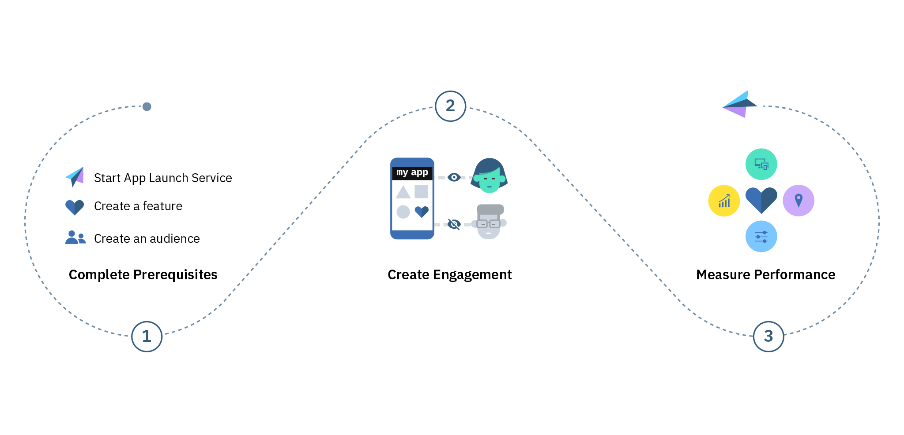

---

copyright:
years: 2017

---

{:new_window: target="_blank"}
{:shortdesc: .shortdesc}
{:screen:.screen}
{:codeblock:.codeblock}
{:pre: .pre}
{:tip: .tip}

# Tutoriel Premiers pas
{: #gettingstartedtemplate}
Dernière mise à jour le 18 janvier 2018
{: .last-updated}

{:shortdesc}

{{site.data.keyword.engage_full}} permet aux propriétaires d'applications de lancer rapidement des fonctions sur des applications mobiles et de mesurer leur impact en contrôlant le public ciblé. Le propriétaire de l'application peut travailler avec des développeurs d'applications afin de définir des indicateurs clé de performance pour les fonctions, collecter des réponses et décider des déploiements ou annulations de fonctions. Le service offre également la possibilité de tester diverses variantes des fonctions d'application, de l'interface utilisateur et des messages, et permet de prendre des décisions sur la base de commentaires en retour.

Procédures de base qui vous permettront de démarrer :

1. [Satisfaire les prérequis](/docs/services/app-launch/app_prerequisites.html)
1. [Créer un engagement](/docs/services/app-launch/app_feature_toggle.html)
2. [Mesurer les performances](/docs/services/app-launch/app_measure_performance.html)

L'image suivante présente le cycle de vie du service {{site.data.keyword.engage_short}}.

  

