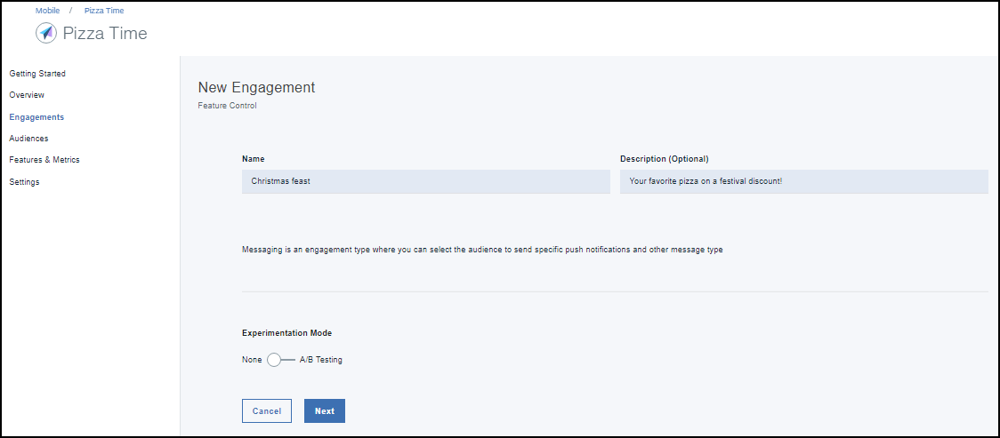

---

copyright:
 years: 2017

---

{:new_window: target="_blank"}
{:shortdesc: .shortdesc}
{:screen:.screen}
{:codeblock:.codeblock}

# Creazione di un impegno utilizzando Feature Control
{: #feature_control}
Ultimo aggiornamento: 12 ottobre 2017
{: .last-updated}

Puoi creare un impegno utilizzando Feature Control. 

Assicurati di aver superato e ottenuto i seguenti [prerequisiti](app_prerequisites.html) necessari.

La seguente immagine ti fornisce una panoramica dei passi che è necessario completare per la creazione di una funzione.
	

Completa la seguente procedura per creare un impegno utilizzando Feature Control:

1. Puoi creare un impegno utilizzando uno dei seguenti metodi: 
	- Fai clic su **Engagements** nel pannello di navigazione. 
	- Seleziona **Create Engagements** nella nuova funzione che hai creato.
	- Nel pannello di navigazione, fai clic su **Overview** > **Create New Engagement** .
	
2. Viene visualizzata la finestra per il nuovo impegno.
 
	
3. Fornisci un nome e una descrizione al tuo nuovo impegno. Assicurati di fornire un nome impegno univoco e non uno già elencato tra gli impegni.
	
	Per effettuare un esperimento controllato con più varianti della funzione, seleziona **A/B testing** nella modalità di sperimentazione.

4. Fai clic su **Next**.
5. Scegli la funzione che hai creato. Puoi anche scegliere di aggiungere e definire le varianti con cui desideri eseguire esperimenti.
	

5. Fai clic su **Next**.
6. Seleziona i destinatari.
	

5. Fai clic su **Next**.
6. Definisci un trigger scegliendo l'ora e le date di inizio e di fine.
	
7. Fai clic su **Create**.
8. Il nuovo impegno viene ora visualizzato nella finestra dei dettagli dell'impegno.
	

Puoi ora misurare le [prestazioni](app_measure_performance.html) del tuo impegno.

