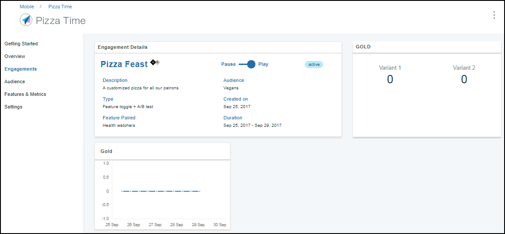
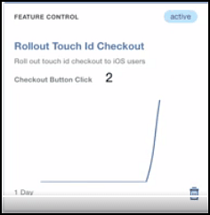

---

copyright:
 years: 2017

---

{:new_window: target="_blank"}
{:shortdesc: .shortdesc}
{:screen:.screen}
{:codeblock:.codeblock}

# Analisi della risposta della funzione
{: #applaunch_type}
Ultimo aggiornamento: 12 ottobre 2017
{: .last-updated}

App Launch ti facilita a creare e raccogliere le metriche della funzione per i vari impegni che hai creato.

Assicurati di aver superato e ottenuto i [prerequisiti](app_prerequisites.html) e di aver
[creato un impegno utilizzando Feature Control](app_feature_toggle.html). 

Completa la seguente procedura per raccogliere le metriche per gli impegni che hai creato.

1. Fai clic su **Engagements**.

2. Scegli l'impegno che hai creato.  

	La finestra dei dettagli dell'impegno visualizza le informazioni raccolte. 

	

Il grafico ti fornisce le informazioni dettagliate in tempo reale su come è stata ricevuta la funzione dai destinatari. Puoi utilizzare le informazioni per comprendere i punti salienti o le criticità per eseguire ulteriore personalizzazioni sulla funzione prima di distribuirla ampiamente ai destinatari.
	

 

