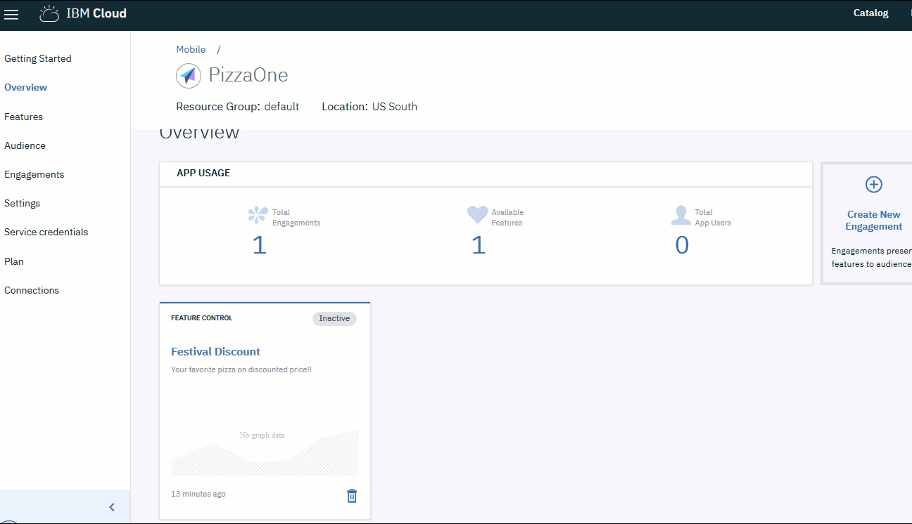

---

copyright:
 years: 2017

---

{:new_window: target="_blank"}
{:shortdesc: .shortdesc}
{:screen:.screen}
{:codeblock:.codeblock}

# Configura In-App Messaging
{: #app_messaging}
Ultimo aggiornamento: 18 gennaio 2018
{: .last-updated}

Puoi creare un impegno utilizzando In-App Messaging. 

Tramite questo impegno un proprietario di un'applicazione può inviare le notifiche agli utenti dell'applicazione mentre la stanno attivamente utilizzando.

I messaggi possono essere indirizzati a tutti gli utenti dell'applicazione o a una specifica serie di utenti e dispositivi. Per ogni messaggio che invii al servizio, i destinatari previsti ricevono una notifica.

I messaggi all'interno dell'applicazione possono essere pianificati definendo una data/ora di inizio/fine. Puoi anche pianificarli in base a un evento.

Questi messaggi sono più personalizzabili perché si basano su analisi approfondite sulla scelta dell'utente, le interazioni dell'utente, il dispositivo, i log dell'applicazione ecc.

I messaggi all'interno dell'applicazione possono essere utilizzati per:

- Inviare messaggi personalizzati
- Inviare messaggi agli utenti che hanno disattivato le notifiche push
- Richiedere un feedback o un impegno agli utenti in una conversazione
- Inviare messaggi importanti dopo aver saputo quello che l'utente sta cercando
- Impegnare i clienti attivi e fedeli
- Informare gli utenti sugli aggiornamenti dell'applicazione o avviare una nuova funzione
e così via.

**Abilitazione della funzionalità In-App Messaging**

Assicurati di aver superato e ottenuto i seguenti [prerequisiti](app_prerequisites.html) necessari.

Completa la seguente procedura per creare un impegno utilizzando l'opzione di messaggistica:

1. Puoi creare un impegno utilizzando uno dei seguenti metodi:
	- Fai clic su **Engagements** nel pannello di navigazione. 
	- Seleziona **Create Engagement** nella nuova funzione che hai creato.
	- Nel pannello di navigazione, fai clic su **Overview** > **Create New Engagement**.
	
2. Viene visualizzata la finestra per il nuovo impegno.
	
3. Fornisci un nome e una descrizione al tuo nuovo impegno. Assicurati di fornire un nome impegno univoco e non uno già elencato tra gli impegni. 

    **Select Engagement type** come **In-App Messaging**
	
	Per effettuare un esperimento controllato con più varianti della funzione di messaggistica, seleziona **A/B testing** in **Select Experimentation Type**. Fai clic su **Next**.

4. Riempi le proprietà del messaggio e fai clic su **Next**.
	
5. **Select Audience** e la percentuale di destinatari che vuoi raggiungere. Fai clic su **Next**.

6. Definisci un trigger selezionando una **Start/End Date and Time**. 

    **Select Event.**  Fai clic su **Next**.	

7. Associa gli elementi alle metriche che vuoi misurare tramite di essi. Seleziona l'elemento e riempi i dettagli della metrica. Fai clic su **Save**.	

Il nuovo impegno viene ora visualizzato nella finestra dei dettagli dell'impegno.
	
Puoi ora misurare le [prestazioni](app_measure_performance.html) del tuo impegno.	
	

