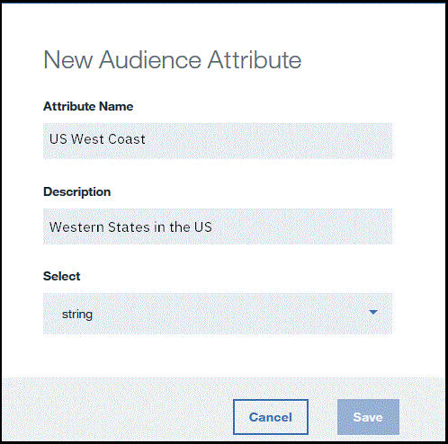

---

copyright:
 years: 2017

---

{:new_window: target="_blank"}
{:shortdesc: .shortdesc}
{:screen:.screen}
{:codeblock:.codeblock}

# Prerequisiti
{: #prerequisites}
Ultimo aggiornamento: 13 ottobre 2017
{: .last-updated}

## Creazione di un'istanza del servizio App Launch
{: #prerequisites_1}

1. Nel [Catalogo IBM Bluemix](https://console.ng.bluemix.net/catalog/), fai clic su **Mobile** > **App Launch**.
2. Fornisci un nome del servizio e delle credenziali.
3. Scegli di collegarti ad altre applicazioni esistenti o lascialo senza associazioni.
4. Fai clic su **Create**.

Puoi scegliere di creare un servizio associato o non associato. I servizi associati sono collegati ad altre applicazioni Bluemix, mentre i servizi non associati sono autonomi e non collegati ad altre applicazioni. Le applicazioni del servizio App Launch non sono collegate per impostazioni predefinita.

## Inizializzazione della tua applicazione
{: #prerequisites_app}

1. Fai clic su **Settings**.
1. Scarica uno degli SDK, in base al tuo tipo di piattaforma:
	- [iOS](https://github.ibm.com/Engage/bms-clientsdk-ios-swift-engage)
	- [Android](https://github.ibm.com/Engage/bms-clientsdk-android-engage)

2. Copia le chiavi di configurazione per inizializzare la tua applicazione. Utilizza segreto applicazione, GUID applicazione e segreto client per configurare la tua applicazione e creare gli impegni.

## Creazione di una funzione
{: #prerequisites_2}

Il servizio {{site.data.keyword.engage_short}} ti consente di creare e verificare le risposte alle funzioni. 

Per creare una funzione, completa la seguente procedura: 

1. Fai clic su **Features & Metrics** > **Create Feature**.

2. Aggiorna il modulo Create New Feature and Metrics con un nome e una descrizione della funzione appropriati. Puoi anche definire le proprietà della funzione e aggiungere metriche per misurare l'impatto del tuo impegno.

3. Fai clic su **Create**. La nuova funzione viene ora visualizzata nel pannello delle funzioni e delle metriche.

4. Per abilitare una funzione da utilizzare come un impegno, fai clic sulla funzione che hai creato. 

5. Nella finestra dei dettagli della funzione, scegli di aggiornare lo stato della tua funzione in **Ready**.

6. Fai clic su **Update Status**.

7. Aggiorna la tua applicazione in modo che includa i codici della funzione e gli attributi appena creati nella tua applicazione iOS o Android. 

8. La funzione è ora pronta per essere utilizzata.

## Creazione dei destinatari
{: #prerequisites_2}

Per creare i destinatari, completa la seguente procedura: 

1. Crea un attributo dei destinatari. 

	a. Fai clic su **Audience** > **Create Audience Attribute**.

	b. Fornisci i seguenti valori:

	- **Nome**: fornisci un nome appropriato per l'attributo.
	- **Descrizione**: una breve descrizione dell'attributo.
	- **Tipo**:	scegli il tipo di attributo.
	- **Valori consentiti**: immetti i valori dell'attributo che desideri utilizzare.

	

	Puoi scegliere di creare più attributi dei destinatari, come elencato nella seguente immagine, in base ai tuoi requisiti.
	
	

2. Crea i destinatari. 

	a. Fai clic su **Create Audience**.

	b. Fornisci un nome e una descrizione appropriati nella finestra dei nuovi destinatari.

	c. Seleziona un attributo e fai clic su **Add**.

	

	d. Scegli le opzioni richieste dagli attributi elencati.

	e. Fai clic su **Save**.

Puoi ora creare un impegno utilizzando l'opzione [Feature Control](app_feature_toggle.html).
