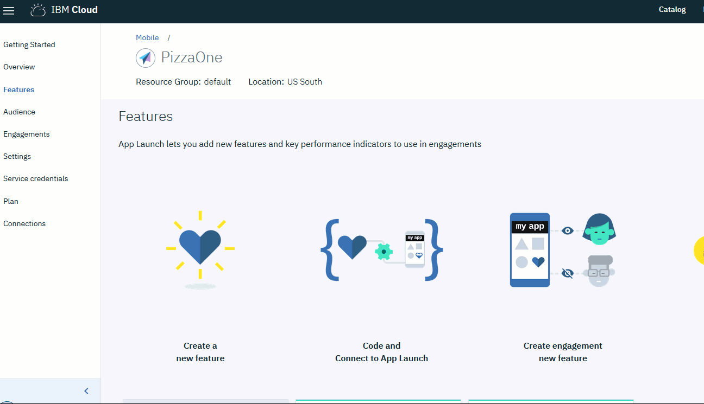

---

copyright:
 years: 2017

---

{:new_window: target="_blank"}
{:shortdesc: .shortdesc}
{:screen:.screen}
{:codeblock:.codeblock}

# 前提条件
{: #prerequisites}
最終更新日: 2018 年 1 月 18 日
{: .last-updated}

## App Launch サービス・インスタンスの作成
{: #prerequisites_1}

1. [IBM Cloud カタログ](https://console.ng.bluemix.net/catalog/)で、**「モバイル」** > **「App Launch」**をクリックします。
2. サービス名を指定します。
3. **「作成」**をクリックします。
4. 他の既存アプリに接続することを選択するか、アンバインドのままにします。

バインドされたサービスまたはアンバインドされたサービスのいずれかを作成することを選択できます。 バインドされたサービスは他の IBM Cloud アプリに接続されています。一方、アンバインドされたサービスはスタンドアロンであり、他のアプリには接続されていません。App Launch サービス・アプリは、デフォルトでアンバインドされています。

## アプリの初期化
{: #prerequisites_app}

1. **「設定」**をクリックします。
1. プラットフォームのタイプに基づいて、いずれかの SDK をダウンロードします。
	- [iOS](https://github.com/ibm-bluemix-mobile-services/bms-clientsdk-swift-applaunch)
	- [Android](https://github.com/ibm-bluemix-mobile-services/bms-clientsdk-android-applaunch)

2. アプリを初期化するため、構成鍵をコピーします。 アプリ秘密鍵、アプリ GUID、およびクライアント秘密鍵を使用して、アプリの構成およびエンゲージメントの作成を行います。

## フィーチャーの作成
{: #prerequisites_2}

{{site.data.keyword.engage_short}} サービスを使用して、フィーチャーへの応答を作成してテストできます。 

フィーチャーを作成するには、以下の手順を実行します。

1. ナビゲーション・ペインで、**「フィーチャー」** > **「新規フィーチャーの作成 (Create New Feature)」**をクリックします。 

2. 「新規フィーチャーおよびメトリックの作成 (Create New Feature and Metrics)」フォームを適切なフィーチャー名と説明で更新します。 フィーチャー・プロパティーを定義し、エンゲージメントの影響を測定するためのメトリックを追加することもできます。JSON を編集して複数のプロパティーを追加するには、**「一括編集 (Bulk edit)」**をクリックします。

3. **「作成」**をクリックします。 新規フィーチャーが「フィーチャー」パネルに表示されます。 

4. フィーチャーは開発されると使用可能になります。

5. フィーチャーがエンゲージメントとして使用されるようにするため、作成したフィーチャーをクリックします。

6. 「フィーチャー詳細 (Feature Details)」ウィンドウで、フィーチャーの「更新状況 (Update Status)」で**「作動可能」**を選択します。

7. **「更新」**状況をクリックします。

8. iOS アプリまたは Android アプリに新しく作成された属性およびフィーチャー・コードを含むようにアプリを更新します。 

9. これでフィーチャーを使用する準備ができました。

「フィーチャー詳細 (Feature Details)」ウィンドウには、フィーチャーを JSON ファイルとしてエクスポートするオプションがあります。この JSON ファイルは、クライアント・アプリケーションでデフォルト値をロードするために使用できます。

## オーディエンスの作成
{: #prerequisites_2}

オーディエンスを作成するには、以下の手順を実行します。

1. オーディエンス属性を作成します。 

	**「オーディエンス (Audience)」** > **「属性の作成 (Create Attribute)」**をクリックします。

	以下の値を入力します。

	- **名前**: 属性の適当な名前を入力します。
	- **説明**: 属性の簡単な説明。
	- **タイプ**:	属性タイプを選択します。
	- **許可される値**: 使用する属性値を入力します。

    次の図で示すように、要件に応じて複数のオーディエンス属性を作成することを選択できます。
	
	
2. オーディエンスを作成します。

	a. **「オーディエンスの作成 (Create Audience)」**をクリックします。

	b. 「新規オーディエンス (New Audience)」ウィンドウで、適切な名前と説明を入力します。

	c. 属性を選択し、**「追加」**をクリックします。

    d. リストされた属性から、必要なオプションを選択します。

	e. **「保存」**をクリックします。
	
	これで、エンゲージメントを作成できるようになりました。

<!-- You can now create an engagement using the [Feature Control](app_feature_toggle.html) option. -->
