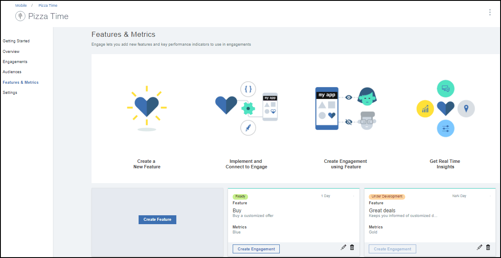
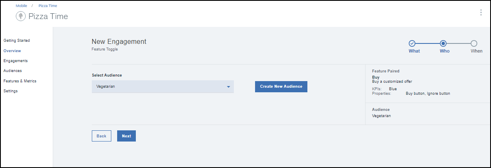

---

copyright:
 years: 2017

---

{:new_window: target="_blank"}
{:shortdesc: .shortdesc}
{:screen:.screen}
{:codeblock:.codeblock}

# 기능 제어를 사용하여 참여 작성
{: #feature_control}
마지막 업데이트 날짜: 2017년 10월 12일
{: .last-updated}

기능 제어를 사용하여 참여를 작성할 수 있습니다. 

필요한 [전제조건](app_prerequisites.html)을 검토한 후 준비가 완료되었는지 확인하십시오.

다음 이미지는 기능 작성을 위해 완료해야 하는 단계에 대한 개요를 제공합니다.
	

기능 제어를 사용하여 참여를 작성하려면 다음 단계를 완료하십시오.

1. 다음 방법 중 하나를 사용하여 참여를 작성할 수 있습니다.
	- 탐색 분할창에서 **참여**를 클릭하십시오. 
	- 작성한 새 기능에 대한 **참여 작성**을 선택하십시오.
	- 탐색 분할창에서 **개요** > **새 참여 작성**을 클릭하십시오.
	
2. 새 참여 창이 표시됩니다.
 
	
3. 새 참여의 이름과 설명을 제공하십시오. 이미 참여에 나열된 이름이 아니라 고유한 참여 이름을 지정했는지 확인하십시오.
	
	여러 기능의 변형을 사용하여 세심한 통제가 이루어진 실험을 수행하려면, 실험 모드에서 **A/B 테스트**를 선택하십시오.

4. **다음**을 클릭하십시오.
5. 작성한 기능을 선택하십시오. 시범적으로 사용할 변형을 추가 및 정의하도록 선택할 수도 있습니다.
	

5. **다음**을 클릭하십시오.
6. 대상을 선택하십시오.
	

5. **다음**을 클릭하십시오.
6. 시간 및 시작 날짜와 종료 날짜를 선택하여 트리거를 정의하십시오.
	
7. **작성**을 클릭하십시오.
8. 이제 새 참여가 참여 세부사항 창에 표시됩니다.
	

이제 참여 [성능](app_measure_performance.html)을 측정할 수 있습니다.

