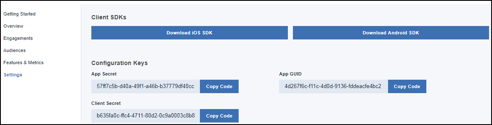

---

copyright:
 years: 2017

---

{:new_window: target="_blank"}
{:shortdesc: .shortdesc}
{:screen:.screen}
{:codeblock:.codeblock}

# 전제조건
{: #prerequisites}
마지막 업데이트 날짜: 2018년 1월 18일
{: .last-updated}

## App Launch 서비스 인스턴스 작성
{: #prerequisites_1}

1. [IBM Cloud 카탈로그](https://console.ng.bluemix.net/catalog/)에서 **모바일** > **App Launch**를 클릭하십시오.
2. 서비스 이름을 제공하십시오.
3. **작성**을 클릭하십시오.
4. 기존의 다른 앱에 연결하거나 바인딩되지 않은 상태를 유지하도록 선택하십시오.

바인딩된 서비스 또는 바인딩되지 않은 서비스를 작성할 것인지 선택할 수 있습니다. 바인딩된 서비스는 다른 IBM Cloud 앱에 연결되는 반면, 바인딩되지 않은 서비스는 독립형이며 다른 앱에 연결되지 않습니다. App Launch 서비스 앱은 기본적으로 바인딩되지 않습니다.

## 앱 초기화
{: #prerequisites_app}

1. **설정**을 클릭하십시오.
1. 플랫폼 유형에 따라 다음 SDK 중 하나를 다운로드하십시오.
	- [iOS](https://github.com/ibm-bluemix-mobile-services/bms-clientsdk-swift-applaunch)
	- [Android](https://github.com/ibm-bluemix-mobile-services/bms-clientsdk-android-applaunch)

2. 앱을 초기화하기 위한 구성 키를 복사하십시오. 앱 시크릿, 앱 GUID 및 클라이언트 시크릿을 사용하여 앱을 구성하고 참여를 작성하십시오.

## 기능 작성
{: #prerequisites_2}

{{site.data.keyword.engage_short}} 서비스를 사용하여 기능에 대한 응답을 작성하고 테스트할 수 있습니다. 

기능을 작성하려면 다음 단계를 완료하십시오.

1. 탐색 분할창에서 **기능** > **새 기능 작성**을 클릭하십시오. 

2. 새 기능 및 메트릭 작성 양식을 적절한 기능 이름과 설명으로 업데이트하십시오. 또한 기능 특성을 정의하고 참여의 영향을 측정하기 위해 메트릭을 추가할 수도 있습니다. JSON을 편집하여 여러 특성을 추가하려면 **대량 편집**을 클릭하십시오.

3. **작성**을 클릭하십시오. 이제 새 기능이 기능 분할창에 표시됩니다. 

4. 기능이 개발되면 사용으로 설정하십시오.

5. 기능을 참여로 사용할 수 있게 하려면 작성된 기능을 클릭하십시오.

6. 기능 세부사항 창에서 기능의 상태를 **준비**로 업데이트하도록 선택하십시오.

7. 상태 **업데이트**를 클릭하십시오.

8. 새로 작성된 속성 및 기능 코드를 iOS 또는 Android 앱에 포함시키도록 앱을 업데이트하십시오. 

9. 이제 기능을 사용할 준비가 되었습니다.

기능 세부사항 창에는 기본값을 로드하기 위해 클라이언트 애플리케이션에서 사용할 수 있는 JSON 파일로 기능을 내보내는 옵션이 있습니다.

## 대상 작성
{: #prerequisites_2}

대상을 작성하려면 다음 단계를 완료하십시오.

1. 대상 속성을 작성하십시오. 

	**대상(Audience)** > **속성 작성**을 클릭하십시오.

	다음 값을 제공하십시오.

	- **이름**: 속성에 대한 적절한 이름을 입력하십시오.
	- **설명**: 속성에 대한 간략한 설명입니다.
	- **유형**:	속성 유형을 선택하십시오.
	- **허용값**: 사용하려는 속성 값을 입력하십시오.

    요구사항에 따라 다음 이미지에 나열된 대로 여러 대상 속성을 작성하도록 선택할 수 있습니다.
	
	
2. 대상을 작성하십시오.

	a. **대상 작성**을 클릭하십시오.

	b. 새 대상 창에서 적절한 이름과 설명을 제공하십시오.

	c. 속성을 선택하고 **추가**를 클릭하십시오.

    d. 나열된 속성에서 필수 옵션을 선택하십시오.

	e. **저장**을 클릭하십시오.
	
	이제 참여를 작성할 수 있습니다.

<!-- You can now create an engagement using the [Feature Control](app_feature_toggle.html) option. -->
