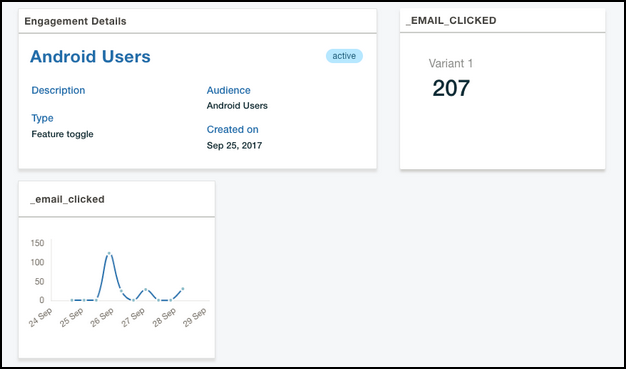
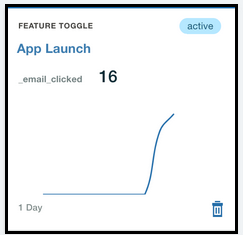

---

copyright:
 years: 2017

---

{:new_window: target="_blank"}
{:shortdesc: .shortdesc}
{:screen:.screen}
{:codeblock:.codeblock}

# Analisando os resultados de resposta
{: #applaunch_type}
Última atualização: 18 de janeiro de 2018
{: .last-updated}

<!-- App Launch empowers you to create and collect Feature Metrics for the various engagements that you have created. -->
O App Launch permite criar e coletar Métricas para vários engajamentos criados.

<!-- Ensure that you have gone through and have completed the [prerequisites](app_prerequisites.html) and have [created an engagement using Feature Control](app_feature_toggle.html).  -->
Verifique se você concluiu os [pré-requisitos](app_prerequisites.html) e criou um engajamento. 

Conclua as etapas a seguir para coletar métricas para os engajamentos que você criou:

1. Clique em **Engajamentos**.

2. Escolha o engajamento que você criou. 

	A janela Detalhes do engajamento exibe as informações coletadas. 

	

O gráfico fornece insights em tempo real sobre como o recurso foi recebido pelo público-alvo. É possível usar as informações para entender os destaques ou pontos de impacto e fazer customização adicional para o recurso antes de lançar o recurso para um público mais amplo.
	

 

