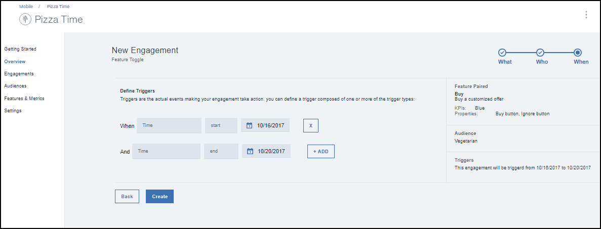

---

copyright:
 years: 2017

---

{:new_window: target="_blank"}
{:shortdesc: .shortdesc}
{:screen:.screen}
{:codeblock:.codeblock}

# Criando um engajamento usando o Controle de recurso
{: #feature_control}
Última atualização: 12 de outubro de 2017
{: .last-updated}

É possível criar um engajamento usando o Controle de recurso. 

Assegure-se de que você completado e de que tenha os [pré-requisitos](app_prerequisites.html) disponíveis.

A imagem a seguir fornece uma visão geral das etapas que precisam ser concluídas para criar um recurso.
	

Conclua as etapas a seguir para criar um engajamento usando o Controle de recurso:

1. É possível criar um engajamento usando um dos métodos a seguir:
	- Clique em **Engajamentos** na área de janela de navegação. 
	- Selecione **Criar engajamentos** no novo Recurso que você criou.
	- Na área de janela de navegação, clique em **Visão geral** > **Criar novo engajamento**. 
2. A janela Novo engajamento é exibida.
 
	
3. Forneça um nome e uma descrição para o seu novo engajamento. Assegure-se de que você dê um nome exclusivo ao engajamento e não um que já esteja listado em Engajamentos.
	
	Para fazer um experimento controlado com diversas variantes do recurso, selecione **Teste A/B** no Modo de teste.

4. Clique em **Next (Avançar)**.
5. Escolha o Recurso que você criou. Também é possível optar por incluir e definir as variantes que você pode querer experimentar.  

5. Clique em **Next (Avançar)**.
6. Selecione um público.   

5. Clique em **Next (Avançar)**.
6. Defina um acionador escolhendo Hora e data de início e data de encerramento. 
7. Clique em **Criar**.
8. O novo compromisso agora aparece na janela Detalhes do engajamento. 

Agora é possível medir o [desempenho](app_measure_performance.html) de seu engajamento.

