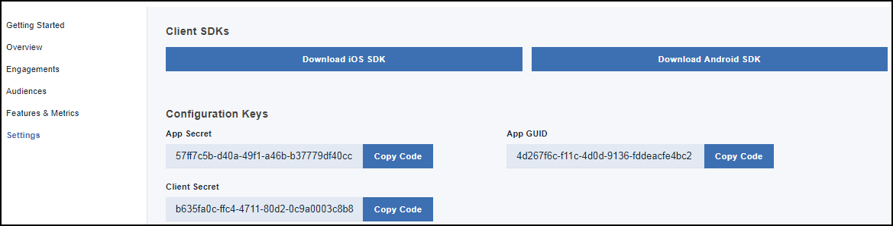

---

copyright:
 years: 2017

---

{:new_window: target="_blank"}
{:shortdesc: .shortdesc}
{:screen:.screen}
{:codeblock:.codeblock}

# Pré-requisito
{: #prerequisites}
Última atualização: 18 de janeiro de 2018
{: .last-updated}

## Criando uma instância de serviço de Ativação de app
{: #prerequisites_1}

1. No [Catálogo do IBM Cloud](https://console.ng.bluemix.net/catalog/), clique em **Dispositivo móvel** > **App Launch**.
2. Forneça um nome de Serviço.
3. Clique em **Criar**.
4. Escolha se conectar a outros apps existentes ou deixe desvinculado.

É possível escolher criar um serviço de limite ou um serviço desvinculado. Os serviços de limite são conectados a outros apps IBM Cloud, enquanto os serviços desvinculados são independentes e não conectados a outros apps. Os apps de serviço de Ativação de app são desvinculados por padrão.

## Inicializando o seu app
{: #prerequisites_app}

1. Clique em **Configurações**.
1. Faça download dos SDK, com base em seu tipo de plataforma:
	- [iOS](https://github.com/ibm-bluemix-mobile-services/bms-clientsdk-swift-applaunch)
	- [Android](https://github.com/ibm-bluemix-mobile-services/bms-clientsdk-android-applaunch)

2. Copie as chaves de configuração para inicializar seu App. Use o Segredo do App, o GUID do App e o Segredo do Cliente para configurar seu app e criar engajamentos.

## Criando um recurso
{: #prerequisites_2}

O serviço {{site.data.keyword.engage_short}} permite criar e testar as respostas para recursos. 

Para criar um recurso, conclua as etapas a seguir:

1. Na área de janela de navegação, clique em **Recursos** > **Criar novo recurso** 

2. Atualize o formulário Criar novo recurso e métricas com um nome apropriado de recurso e descrição. Também é possível definir as propriedades do recurso e incluir métricas para medir o impacto de seu engajamento. Clique em **Edição em massa** para incluir múltiplas propriedades editando o JSON.

3. Clique em **Criar**. O novo recurso agora aparece no painel Recursos. 

4. Ative o recurso quando ele for desenvolvido.

5. Para ativar um recurso para ser usado como um engajamento, clique no Recurso que você criou.

6. Na janela Detalhes do recurso, escolha Atualizar status de seu recurso para **Pronto**.

7. Clique em **Atualizar** Status.

8. Atualize seu app para incluir os atributos recém-criados e códigos de recurso em seu App iOS ou Android. 

9. O recurso agora está pronto para ser usado.

A janela Detalhes do recurso tem uma opção para exportar o recurso como um arquivo JSON que pode ser usado no aplicativo cliente para carregar os valores padrão.

## Criando um público
{: #prerequisites_2}

Para criar um público, conclua as etapas a seguir:

1. Crie um atributo de público. 

	Clique em **Público** > **Criar Atributo**.

	Forneça os seguintes valores:

	- **Nome**: forneça um nome apropriado para o atributo.
	- **Descrição**: uma breve descrição sobre o atributo.
	- **Tipo**: escolha o tipo de atributo.
	- **Valores permitidos**: insira os valores de atributo que você gostaria de usar.

    É possível optar por criar vários atributos de público, conforme listado na imagem a seguir, com base em sua necessidade.
	
	
2. Crie uma audiência.

	a. Clique em **Criar público**.

	b. Forneça um nome apropriado e uma descrição na janela Novo público.

	c. Selecione um atributo e clique em **Incluir**.

    d. Escolha as opções necessárias dos atributos listados.

	e. Clique em **Salvar**.
	
	Agora é possível criar um compromisso.

<!-- You can now create an engagement using the [Feature Control](app_feature_toggle.html) option. -->
