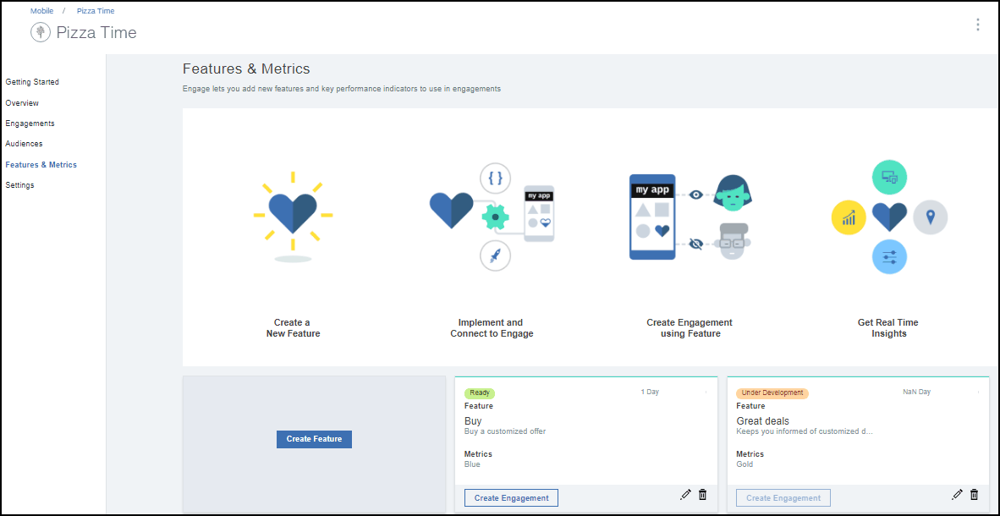
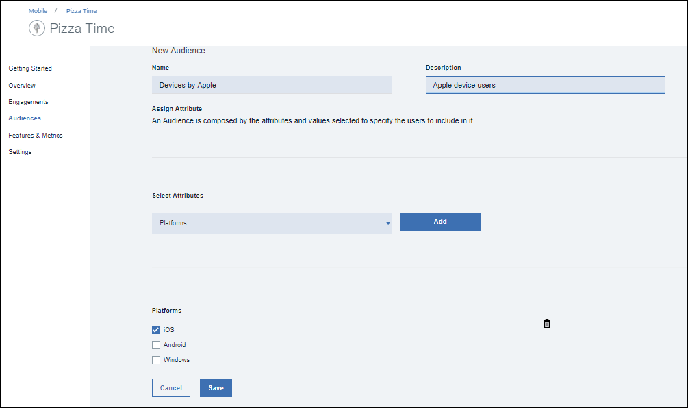

---

copyright:
 years: 2017

---

{:new_window: target="_blank"}
{:shortdesc: .shortdesc}
{:screen:.screen}
{:codeblock:.codeblock}

# Pré-requisito
{: #prerequisites}
Última atualização: 13 de outubro de 2017
{: .last-updated}

## Criando uma instância de serviço de Ativação de app
{: #prerequisites_1}

1. No [IBM Cloud Catalog](https://console.ng.bluemix.net/catalog/), clique em **Móvel** > **Ativação de app**.
2. Forneça um nome de Serviço e um nome de Credencial.
3. Escolha se conectar a outros apps existentes ou deixe desvinculado.
4. Clique em **Criar**.

É possível escolher criar um serviço de limite ou um serviço desvinculado. Os serviços de limite estão conectados a outros apps do IBM Cloud, enquanto os serviços desvinculados são independentes e não conectados a outros apps. Os apps de serviço de Ativação de app são desvinculados por padrão.

## Inicializando o seu app
{: #prerequisites_app}

1. Clique em **Configurações**.
1. Faça download dos SDK, com base em seu tipo de plataforma:
	- [iOS](https://github.ibm.com/Engage/bms-clientsdk-ios-swift-engage)
	- [Android](https://github.ibm.com/Engage/bms-clientsdk-android-engage)

2. Copie as chaves de configuração para inicializar seu App. Use o Segredo do App, o GUID do App e o Segredo do Cliente para configurar seu app e criar engajamentos.

## Criando um recurso
{: #prerequisites_2}

O serviço {{site.data.keyword.engage_short}} permite criar e testar as respostas para recursos. 

Para criar um recurso, conclua as etapas a seguir:

1. Clique em **Recursos e métricas** > **Criar recurso**.

2. Atualize o formulário Criar novo recurso e métricas com um nome apropriado de recurso e descrição. Também é possível definir as propriedades do recurso e incluir métricas para medir o impacto de seu engajamento.

3. Clique em **Criar**. O novo recurso agora aparece no painel Recursos e métricas.  

4. Para ativar um recurso para ser usado como um engajamento, clique no Recurso que você criou.

5. Na janela Detalhes do recurso, escolha Atualizar status do seu recurso para **Pronto**. 

6. Clique em **Atualizar status**.

7. Atualize seu app para incluir os atributos recém-criados e códigos de recurso em seu App iOS ou Android. 

8. O recurso agora está pronto para ser usado. 

## Criando um público
{: #prerequisites_2}

Para criar um público, conclua as etapas a seguir:

1. Crie um atributo de público. 

	a. Clique em **Público** > **Criar atributo de público**.

	b. Forneça os seguintes valores:

	- **Nome**: forneça um nome apropriado para o atributo.
	- **Descrição**: uma breve descrição sobre o atributo.
	- **Tipo**: escolha o tipo de atributo.
	- **Valores permitidos**: insira os valores de atributo que você gostaria de usar.

	

	É possível optar por criar vários atributos de público, conforme listado na imagem a seguir, com base em sua necessidade.
	
	

2. Crie uma audiência.

	a. Clique em **Criar público**.

	b. Forneça um nome apropriado e uma descrição na janela Novo público.

	c. Selecione um atributo e clique em **Incluir**.

	

	d. Escolha as opções necessárias dos atributos listados.

	e. Clique em **Salvar**.

Agora é possível criar um engajamento usando a opção [Controle de recurso](app_feature_toggle.html).
