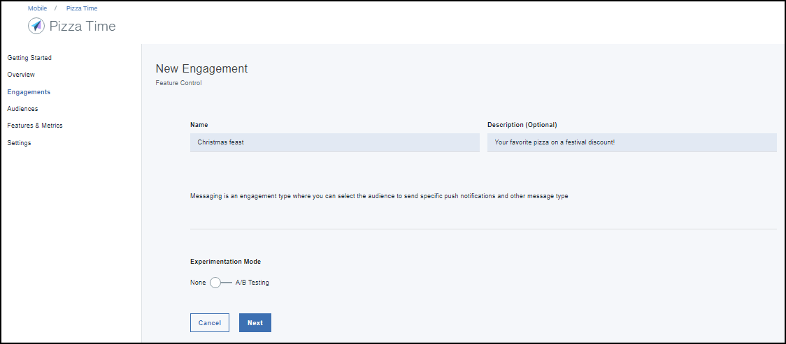

---

copyright:
 years: 2017

---

{:new_window: target="_blank"}
{:shortdesc: .shortdesc}
{:screen:.screen}
{:codeblock:.codeblock}

# 使用功能部件控件创建参与
{: #feature_control}
上次更新时间：2017 年 10 月 12 日
{: .last-updated}

您可以使用功能部件控件创建参与。 

确保您已核对所有[先决条件](app_prerequisites.html)，必要的先决条件都已准备就绪。

下图概要介绍了创建功能部件需要完成的步骤。
	
使用功能部件控件完成下列步骤以创建参与：

1. 您可以使用以下某种方法来创建参与：
	- 在导航窗格中单击**参与**。 
	- 在您创建的新功能部件上选择**创建参与**。
	- 在导航窗格中，单击**概述** > **创建新参与**。

2. 此时将显示“新建参与”窗口。
 
	
3. 提供新参与的名称和描述。确保参与名称唯一，不能使用已在“参与”列表中列出的名称。
	
	要使用功能部件的多个变体进行受控试验，请在“试验模式”中选择 **A/B 测试**。

4. 单击**下一步**。
5. 选择您创建的功能部件。还可以选择添加和定义可能要试验的变体。
	

5. 单击**下一步**。
6. 选择受众。
	

5. 单击**下一步**。
6. 通过选择时间以及开始日期和结束日期来定义触发器。
	
7. 单击**创建**。
8. 现在，新参与显示在“参与详细信息”窗口中。
	

现在您可以测量参与的[性能](app_measure_performance.html)了。

