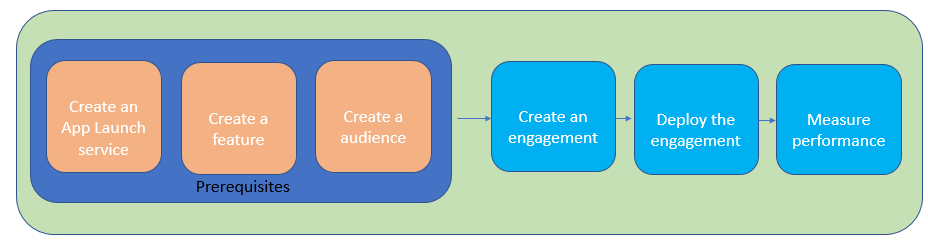

---

copyright:
years: 2017

---

{:new_window: target="_blank"}
{:shortdesc: .shortdesc}
{:screen:.screen}
{:codeblock:.codeblock}
{:pre: .pre}
{:tip: .tip}

# 入门教程
{: #gettingstartedtemplate}
上次更新时间：2017 年 10 月 15 日
{: .last-updated}

{:shortdesc}

利用 {{site.data.keyword.engage_full}}，应用程序所有者可以快速启动移动应用程序功能部件，并通过控制目标受众来测量其影响。应用程序所有者可以与应用程序开发者合作，定义功能部件的关键性能指标，收集响应，决定功能部件的推出和收回版本。该服务还能够测试应用程序功能部件、用户接口、消息的多个变体，这样您就可根据反馈来制定决策。

入门基本步骤：

1. [完成先决条件](/docs/services/app-launch/app_prerequisites.html)
1. [创建参与](/docs/services/app-launch/app_feature_toggle.html)
2. [测量性能](/docs/services/app-launch/app_measure_performance.html)

下图概要介绍了 {{site.data.keyword.engage_short}} 服务的生命周期。

  

