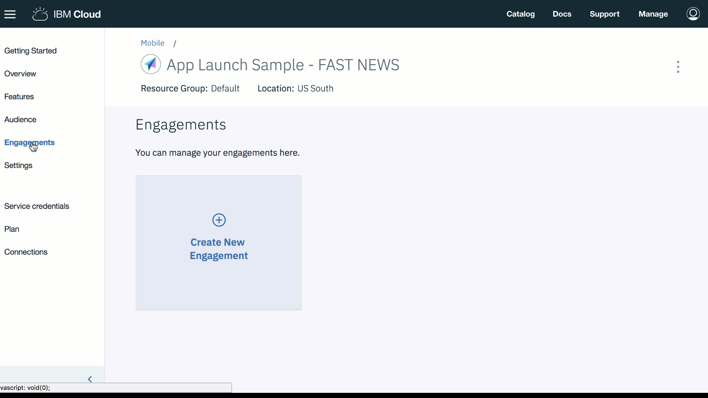

---

copyright:
 years: 2017

---

{:new_window: target="_blank"}
{:shortdesc: .shortdesc}
{:screen:.screen}
{:codeblock:.codeblock}

# 設定特性控制
{: #feature_control}
前次更新：2018 年 1 月 18 日
{: .last-updated}

您可以使用「特性控制」建立參與。 

透過此參與，應用程式擁有者可以藉由在執行時啟用或停用特性，來控制特性的可見性。

特性可以對所有應用程式使用者或特定集合的使用者及裝置啟用/停用。 

特性推出可以藉由定義開始/結束時間和日期來排定及協調。您也可以選擇已定義之特性應該在當天啟用/停用的特定日期。

**啟用特性控制功能**

請確定您已看過並施實所需的[必要條件](app_prerequisites.html)。

完成下列步驟以使用「特性控制」建立參與：

1. 您可以使用下列一項方法建立參與：
	- 在導覽窗格中按一下**參與**。 
	- 在您建立的新特性上選取**建立參與**。
	- 在導覽窗格中，按一下**概觀** > **建立新的參與**。
	
2. 隨即出現「新的參與」時間範圍。
	
3. 提供名稱及說明給您的新參與。請確定您提供唯一的參與名稱，而不是已列在「參與」中的名稱。

     選取**參與類型**作為**特性控制**	
	
	若要進行特性之多種變化的受管制實驗，請在**選取實驗模式**上選取 **A/B 測試**。按**下一步**。
	
4. 選擇您已建立的特性。您也可以選擇新增及定義您可能想要實驗的變化。按**下一步**。

5. 選取對象。按**下一步**。

6. 選擇「時間」及**開始**日期/時間，以及**結束**日期/時間，來定義觸發程式。按一下**儲存**。

7. 新的參與現在出現在「參與詳細資料」視窗中。

您現在可以測量參與的[效能](app_measure_performance.html)。

