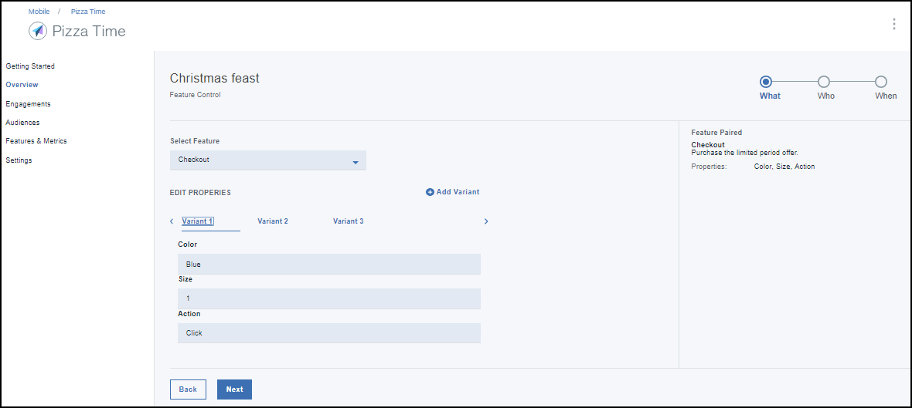

---

copyright:
 years: 2017

---

{:new_window: target="_blank"}
{:shortdesc: .shortdesc}
{:screen:.screen}
{:codeblock:.codeblock}

# 使用特性控制建立參與
{: #feature_control}
前次更新：2017 年 10 月 12 日
{: .last-updated}

您可以使用「特性控制」建立參與。 

請確定您已看過並施實所需的[必要條件](app_prerequisites.html)。

下圖提供您建立特性所需完成的步驟概觀。
	

完成下列步驟以使用「特性控制」建立參與：

1. 您可以使用下列一項方法建立參與：
	- 在導覽窗格中按一下**參與**。 
	- 在您建立的新特性上選取**建立參與**。
	- 在導覽窗格中，按一下**概觀** > **建立新的參與**。
	
2. 隨即出現「新的參與」時間範圍。
 
	
3. 提供名稱及說明給您的新參與。請確定您提供唯一的參與名稱，而不是已列在「參與」中的名稱。
	
	若要進行特性之多種變化的受管制實驗，請在「實驗模式」上選取 **A/B 測試**。

4. 按**下一步**。
5. 選擇您已建立的特性。您也可以選擇新增及定義您可能想要實驗的變化。
	

5. 按**下一步**。
6. 選取對象。
	

5. 按**下一步**。
6. 選擇「時間」及開始日期與結束日期，來定義觸發程式。
	
7. 按一下**建立**。
8. 新的參與現在出現在「參與詳細資料」視窗中。
	

您現在可以測量參與的[效能](app_measure_performance.html)。

