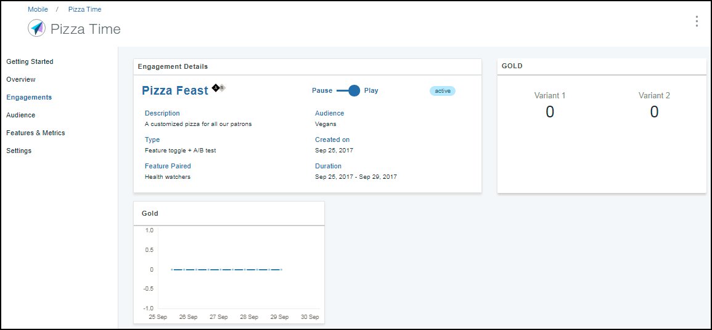

---

copyright:
 years: 2017

---

{:new_window: target="_blank"}
{:shortdesc: .shortdesc}
{:screen:.screen}
{:codeblock:.codeblock}

# 分析特性回應
{: #applaunch_type}
前次更新：2017 年 10 月 12 日
{: .last-updated}

App Launch 讓您能建立及收集您所建立之各種參與的「特性度量值」。

請確定您已看過並完成[必要條件](app_prerequisites.html)，並且已經[使用特性控制建立參與](app_feature_toggle.html)。 

完成下列步驟，以收集您建立之參與的度量值：

1. 按一下**參與**。

2. 選擇您已建立的參與。 

	「參與詳細資料」視窗會顯示收集到的資訊。 

	

圖形讓您能即時深入了解目標對象接收特性的情形。您可以使用資訊來瞭解最受歡迎的部分或是痛點，因此對特性進行進一步的自訂，然後才將特性推出給更廣泛的對象。
	

 

