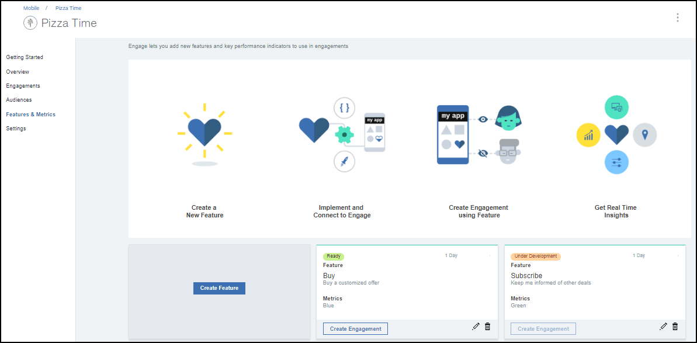

---

copyright:
 years: 2017

---

{:new_window: target="_blank"}
{:shortdesc: .shortdesc}
{:screen:.screen}
{:codeblock:.codeblock}

# 必要條件
{: #prerequisites}
前次更新：2017 年 10 月 13 日
{: .last-updated}

## 建立 App Launch 服務實例
{: #prerequisites_1}

1. 在 [IBM Bluemix 型錄](https://console.ng.bluemix.net/catalog/)中，按一下**行動** > **App Launch**。
2. 提供服務名稱和認證名稱。
3. 選擇連接至其他現有應用程式，或維持不連結。
4. 按一下**建立**。

您可以選擇建立連結服務或未連結服務。連結服務會連接至其他 Bluemix 應用程式，而未連結服務則是獨立式且未連接至其他應用程式。依預設，App Launch 服務應用程式為未連結。

## 起始設定應用程式
{: #prerequisites_app}

1. 按一下**設定**。
1. 根據您的平台類型，下載任一 SDK：
	- [iOS](https://github.ibm.com/Engage/bms-clientsdk-ios-swift-engage)
	- [Android](https://github.ibm.com/Engage/bms-clientsdk-android-engage)

2. 複製配置金鑰以起始設定您的應用程式。請使用「應用程式密碼」、「應用程式 GUID」及「用戶端密碼」來配置您的應用程式並建立參與。

## 建立特性
{: #prerequisites_2}

{{site.data.keyword.engage_short}} 服務容許您建立特性及測試特性的回應。 

若要建立特性，請完成下列步驟：

1. 按一下**特性及度量值** > **建立特性**。

2. 使用適當的特性名稱和說明，更新「建立新的特性及度量值」表單。您也可以定義特性內容，並新增度量值以測量參與的影響。

3. 按一下**建立**。新的特性現在會出現在「特性及度量值」畫面上。

4. 若要讓特性能用來作為參與，請按一下您建立的特性。

5. 在「特性詳細資料」視窗中，選擇將特性的狀態更新為**備妥**。

6. 按一下**更新狀態**。

7. 更新您的應用程式，以在您的 iOS 或 Android 應用程式包含剛建立的屬性及特性碼。 

8. 特性現在已經可以使用。

## 建立對象
{: #prerequisites_2}

若要建立對象，請完成下列步驟：

1. 建立對象屬性。 

	a. 按一下**對象** > **建立對象屬性**。

	b. 提供下列值：

	- **名稱**：提供屬性的適當名稱。
	- **說明**：屬性上的簡要說明。
	- **類型**：選擇屬性類型。
	- **容許值**：輸入您要使用的屬性值。

	

	您可以根據您的需求選擇建立多個對象屬性，如下圖中所列。
	
	

2. 建立對象。

	a. 按一下**建立對象**。

	b. 在「新的對象」視窗上提供適當的名稱及說明。

	c. 選取屬性，然後按一下**新增**。

	

	d. 從列出的屬性選擇必要的選項。

	e. 按一下**儲存**。

您現在可以使用[特性控制](app_feature_toggle.html)選項建立參與。
